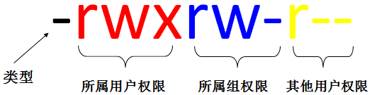

# linux basic

* 当前路径

        pwd

* cd命令
        
  * 上一级目录   

        cd .. 

  * home目录

        # go straight to the home folder
        cd 

  * 前一目录

        # (with a hyphen) to move to your previous directory
        cd- 

* ls
  * 普通

        ls
  * 其它

        #所有子目录
        ls -R 

        #所有隐藏文件：show the hidden files
        ls -a

        # 所有信息：list the files and directories with detailed information like the permissions, size,owner, etc.
        ls -al
        ls -al -h
    
* cat (short for concatenate)

      cat file.txt

      # creates a new file
      cat > filename
      
      # joins two files (1 and 2) and stores the output of them in a new file (3)
      cat filename1 filename2>filename3

* cp: copy

      cp src_file dst_dir

* mv: move

      mv src_file dst_dir

* mkdir

      # 创建路径
      mkdir dir
      mkdir Music/Newfile
      mkdir -p mkdir -p Music/2020/Newfile

      # use the p (parents) option to create a directory in between two existing directories. For example, mkdir -p Music/2020/Newfile will create the new “2020” file.

* rmdir: delete a dir; 只能删除空文件夹

* rm: remove，删除

      rm file
      rm -r dir

      rm -i file
      rm -i -r dir

* touch:创建一个文件

      touch test.txt

* locate：定位文件

       locate -i school*note
      
* find：定位文件

      Similar to the locate command, using find also searches for files and directories. The difference is, you use the find command to locate files within a given directory.
      As an example, find /home/ -name notes.txt command will search for a file called notes.txt within the home directory and its subdirectories.
      Other variations when using the find are:
      To find files in the current directory use, find . -name notes.txt
      To look for directories use, / -type d -name notes. txt

* grep：在给定文件中搜索

      grep blue notepad.txt 
      # search for the word blue in the notepad file. Lines that contain the searched word will be displayed fully.

* sudo：“SuperUser Do”

* df -h

      作用：用于查看Linux文件系统的状态信息,显示各个分区的容量、已使用量、未使用量及挂载点等信息、看剩余空间。
      语法：df [-hkam] [挂载点]
      参数：
            -h（human-readable）根据磁盘空间和使用情况 以易读的方式显示 KB,MB,GB
            -k 以KB 为单位显示各分区的信息，默认
            -M 以MB为单位显示信息
            -a 显示所有分区包括大小为0 的分区   

* du -h -d 1

      作用：用于查看文件或目录的大小（磁盘使用空间）
      语法：du [-abhs] [文件名目录]
      参数：
      -a 显示子文件的大小
      -h 以易读的方式显示 KB,MB,GB等
      -s summarize 统计总占有量
      
      举例：
      
* df命令和du命令的区别：

  1. df命令是从文件系统考虑的，不仅考虑文件占用的空间，还要统计被命令或者程序占用的空间。

  2. du命令面向文件，只计算文件或目录占用的空间。

  3. **du -h -d 1**  或者 **du -h --max-depth=1**

*  linux的权限管理
  1. 有哪几种权限？

  

            格式：所有者 所属组 其他人
            第1位：文件类型（d 目录，- 普通文件，l 链接文件）
            第2-4位：所属用户(所有者)权限，用u（user）表示
            第5-7位：所属组权限，用g（group）表示
            第8-10位：其他用户（其他人）权限，用o（other）表示
            第2-10位：表示所有的权限，用a（all）表示

  2. 权限更改-chmod

            英文：change mode (change the permissions mode of a file)
            作用：改变文件或目录权限
            语法：chmod [{ugoa}{+-=}{rwx}] [文件名或目录]
            chmod [mode=421] [ 文件或目录]
            参数：-R 下面的文件和子目录做相同权限操作（Recursive递归的）
            注释：
            1、用数字来表示权限（r=4，w=2，x=1，-=0）。例如：
            chmod  750  b.txt
            2、 rwx和数字表示方式能随意切换
            3、root用户是超级用户，不管有没有权限，root都能进行更改。不能用一个普通用户去修改另一个普通用户的权限。
  3. 更改所有者-chown

            英文：change file ownership
            作用：更改文件或者目录的所有者
            语法 : chown user[:group] file...
            参数：-R 递归修改
            参数格式 : user 新的档案拥有者的使用者 ID
            group 新的档案拥有者的使用者群体(group)
            chown lee file1   把file1文件的所有者改为用户lee chown lee:test file1   把file1文件的所有者改为用户lee,所属组改为test chown –R  lee:test dir   修改dir及其子目录的所有者和所属组
  4. 改变所属组chgrp

            英文：change file group ownership
            作用：改变文件或目录的所属组
            语法 : chgrp [group] file...
            chgrp root test.log 把test.log的所属组修改为root

* head ; tail: 显示前多少行或者后多少行

          head -20 file

* 压缩解压缩

            # 压缩
            tar -czf small.tar.gz pdbfiles/
            tar -czf file_name.tar.gz file_name
            # 解压缩
            tar -xvf file_name.tar

* wget command
  
  The Linux command line is super useful — you can even download files from the internet with the help of the wget command. To do so, simply type wget followed by the download link.

* 其它

  * man，说明： man tail； man tar
  * uname：操作系统
  * top 和 htop：cpu查看
  * history： 1000条历史操作记录
  * echo：move some data into a file； e.g.  echo Hello, my name is John >> name.txt
  * zip unzip：压缩解压缩
  * hostname：主机名称
  * useradd, userdel command：添加和删除用户
  * clear: 清除终端

  * Ctrl+C 将停止并终止命令，
  * Ctrl+Z 将简单地暂停命令

  * Ctrl+A将您移至行首，
  * Ctrl+E将您移至行尾

  * You can run multiple commands in one single command by using the “;” to separate them. 
    * For example Command1; Command2; Command3. 
    * Or use && if you only want the next command to run when the first one is successful.

* ref: 

    * https://www.cnblogs.com/zhangchao162/p/9614145.html
    * https://www.runoob.com/linux/linux-command-manual.html
    * https://www.hostinger.com/tutorials/linux-commands

