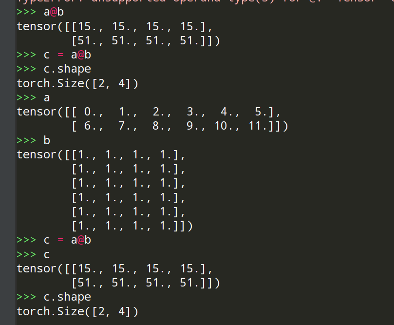
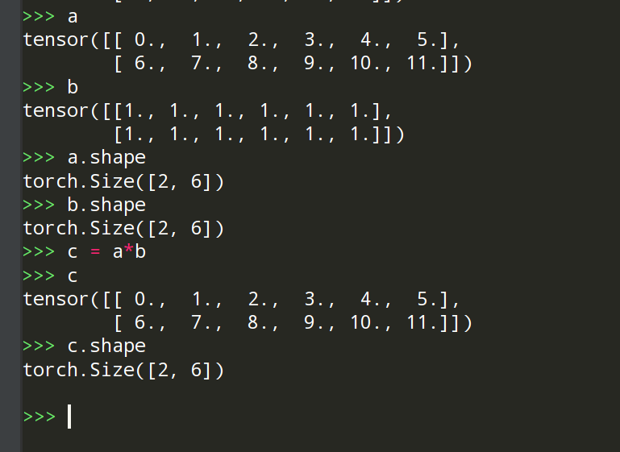
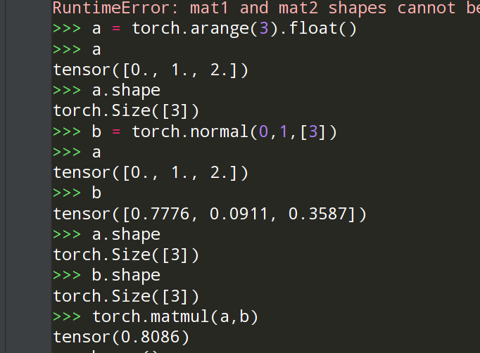
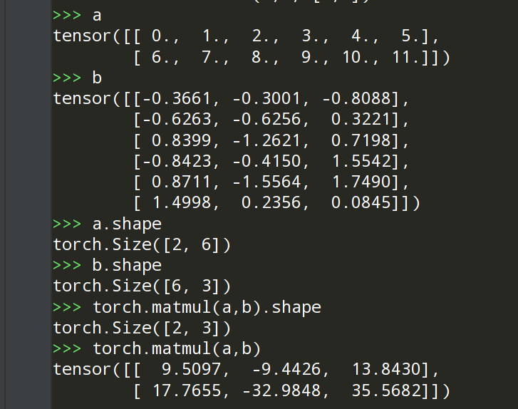

# pytorch乘法

* @运算，
* *运算，
* torch.mul(), 
* torch.mm(),
* torch.matmul()


## @和torch.mm()相同，为矩阵乘法
```
a = torch.arange(12).reshape(2,6).reshape(2,6).float()
b = torch.ones(6,4)
c = a@b
# or c = torch.mm(a,b)
```

```
a = torch.arange(12).reshape(2,6).reshape(2,6).float()
b = torch.ones(2,6)
c = a*b
# or c = torch.mul(a,b)
```
## *和torch.mul()相同，为同位置相乘（哈德玛乘积）


## torch.matmul()
### 如果两个输入都是1为张量，结果是dot product
``` 
a = torch.arange(3).float()
b = torch.normal(0,1,[3])
torch.matmul(a,b)
 ```


### 如果两个输入都是2维张量，做矩阵乘法

```a = torch.arange(12).reshape(2,6).reshape(2,6).float()
b = torch.normal(0,1, [2,6])
```


### 1d,2d
> If the first argument is 1-dimensional and the second argument is 2-dimensional, a 1 is prepended to its dimension for the purpose of the matrix multiply. After the matrix multiply, the prepended dimension is removed.

### 2d, 1d
> If the first argument is 2-dimensional and the second argument is 1-dimensional, the matrix-vector product is returned.

> If both arguments are at least 1-dimensional and at least one argument is N-dimensional (where N > 2), then a batched matrix multiply is returned. If the first argument is 1-dimensional, a 1 is prepended to its dimension for the purpose of the batched matrix multiply and removed after. If the second argument is 1-dimensional, a 1 is appended to its dimension for the purpose of the batched matrix multiple and removed after. The non-matrix (i.e. batch) dimensions are broadcasted (and thus must be broadcastable). For example, if input is a (j \times 1 \times n \times n)(j×1×n×n) tensor and other is a (k \times n \times n)(k×n×n) tensor, out will be a (j \times k \times n \times n)(j×k×n×n) tensor.

> Note that the broadcasting logic only looks at the batch dimensions when determining if the inputs are broadcastable, and not the matrix dimensions. For example, if input is a (j \times 1 \times n \times m)(j×1×n×m) tensor and other is a (k \times m \times p)(k×m×p) tensor, these inputs are valid for broadcasting even though the final two dimensions (i.e. the matrix dimensions) are different. out will be a (j \times k \times n \times p)(j×k×n×p) tensor.


ref:
https://blog.csdn.net/beauthy/article/details/121103704
https://pytorch.org/docs/stable/generated/torch.matmul.html