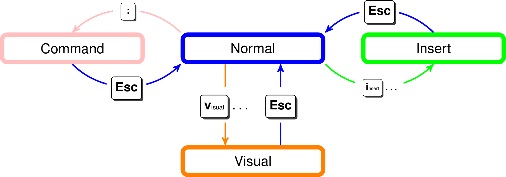

# vim command

## Modal editing
* Normal: for moving around a file and making edits
* Insert: for inserting text
* Replace: for replacing text
* Visual (plain, line, or block): for selecting blocks of text
* Command-line: for running a command

  
## command-line

    :q quit (close window)
    :w save (“write”)
    :wq save and quit
    :e {name of file} open file for editing
    :ls show open buffers
    :help {topic} open help
    :help :w opens help for the :w command
    :help w opens help for the w movement

## 移动

    Basic movement: hjkl (left, down, up, right)
    Words: w (next word), b (beginning of word), e (end of word)
    Lines: 0 (beginning of line), ^ (first non-blank character), $ (end of line)
    Screen: H (top of screen), M (middle of screen), L (bottom of screen)
    Scroll: Ctrl-u (up), Ctrl-d (down)
    File: gg (beginning of file), G (end of file)
    Line numbers: :{number}<CR> or {number}G (line {number})
    Misc: % (corresponding item)
    Find: f{character}, t{character}, F{character}, T{character}
    find/to forward/backward {character} on the current line
    , / ; for navigating matches
    Search: /{regex}, n / N for navigating matches

